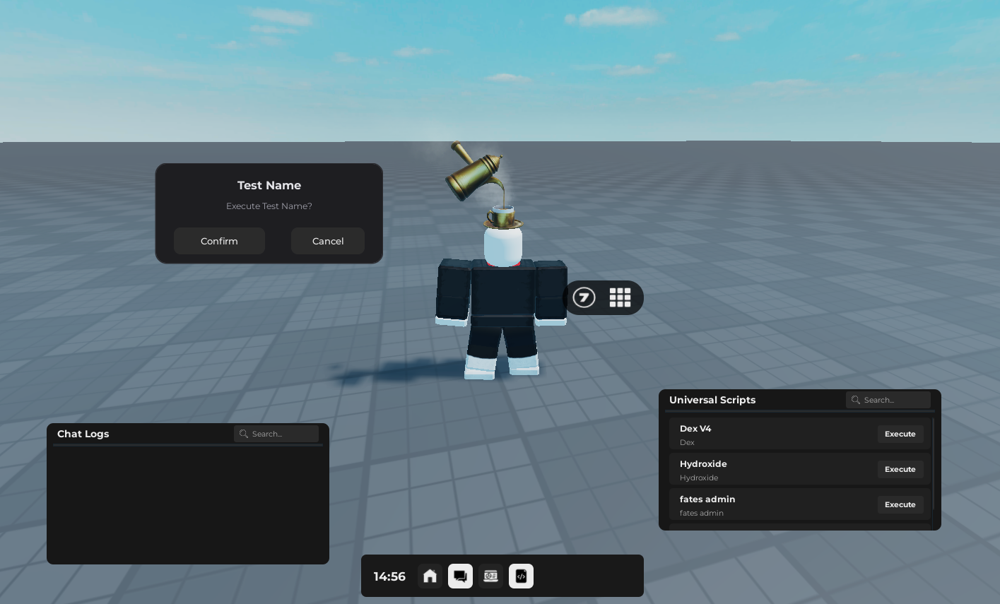

# UI Menu-7yd7

Simple and customizable UI menu system for Roblox scripts



## Getting Loadstring
```lua
loadstring(game:HttpGet("https://raw.githubusercontent.com/7yd7/Menu-7yd7/refs/heads/Script/basis.lua"))()
```

## Creating UI Interface button
```lua
getgenv().createButton({
	image = "rbxassetid://1",
	name = "Test", 
	enabled = true,
	closeOnClick = false,
	action = function(buttonData) 
		print("test")
	end
})
```

**Parameters:**
- `image` - Button icon (Roblox asset ID)
- `name` - Button display name
- `enabled` - Button state (true/false)
- `closeOnClick` - Close menu when clicked
- `action` - Function to run when clicked

## Managing Button States
```lua
getgenv().updateAllowedButtonData({
	["Home"] = false,
})
```
> **Note:** Default buttons list available [here](https://raw.githubusercontent.com/7yd7/Menu-7yd7/refs/heads/Script/Create/buttons.lua)

## Creating Universal Scripts button
```lua
getgenv().createScriptButton({
	name = "Test Print ( TEST RUN !!)",
	author = "Test author",
	color = Color3.fromRGB(35, 35, 35),
	action = function() 
		print("Test") 
	end
})
```

**Parameters:**
- `name` - Script name
- `author` - Author name  
- `color` - Button background color
- `action` - Script code to execute

## Creating UI Confirmation or Cancel

```lua
getgenv().createConfirmation({
    name = "Test Name",
    description = "Test description",
    action = function()
       print("Test Run")
    end
})
```

**Parameters:**
- `name` - Script name
- `description` - description name  
- `action` - Script code to execute

## Creating UI Notify
```lua
getgenv().Notify({
  Title = 'Test',
  Content = 'Hello World', 
  Duration = 5
})
```

**Parameters:**
- `name` - Script name
- `Content` - Content name  
- `Duration` - disappearance time period

## Update Configuration
```lua
getgenv().updateConfig({
	OPEN_KEY = Enum.KeyCode.F8,
	ButtonHeight = 40,
	Height = 60,
})
```
> **More options:** Full config list [here](https://raw.githubusercontent.com/7yd7/Menu-7yd7/refs/heads/Script/GUIS/List.lua) (Line 40)
